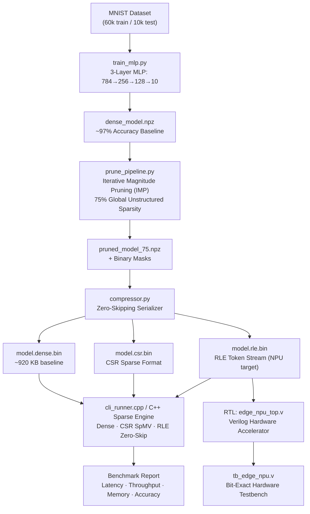

# VELTRAXX Hackathon — Sparse Weight Pruning & Run-Length Encoding Engine for Edge NPU

## 🎯 Project Goal
Build a full hardware+software co-design pipeline that compresses a neural network by **≥60% sparsity**, achieves **≥2× memory reduction**, and delivers **≥1.5× inference speedup** on a simulated Edge NPU — all with **zero catastrophic accuracy loss**.

## 🖥️ Interactive React Dashboard & UI

Launch the full interactive React 18 Edge NPU & Sparse Co-Design Dashboard with 1-click:

```powershell
# Windows 1-Click Launch:
.\run_ui.bat

# Or run with Python:
python server.py
# Open in browser: http://localhost:8000
```

---

## 🏗️ System Architecture



---

## 📁 Directory Map

| Path | Contents |
|---|---|
| [`src/engine/`](file:///C:/Users/Deepika%20MK/VELTRAXX-HACKATHON---INOVATORS/src/engine) | C++ inference engine headers |
| [`src/rtl/`](file:///C:/Users/Deepika%20MK/VELTRAXX-HACKATHON---INOVATORS/src/rtl) | Verilog RTL modules |
| [`scripts/`](file:///C:/Users/Deepika%K/VELTRAXX-HACKATHON---INOVATORS/scripts) | Python ML pipeline scripts |
| [`tb/`](file:///C:/Users/Deepika%20MK/VELTRAXX-HACKATHON---INOVATORS/tb) | RTL simulation testbench |
| [`tests/`](file:///C:/Users/Deepika%20MK/VELTRAXX-HACKATHON---INOVATORS/tests) | Python unit tests |
| [`build/`](file:///C:/Users/Deepika%20MK/VELTRAXX-HACKATHON---INOVATORS/build) | Compiled executables |
| [`outputs/`](file:///C:/Users/Deepika%20MK/VELTRAXX-HACKATHON---INOVATORS/outputs) | Binary models + MNIST data |

---

## 🧩 Component Deep-Dive

### 1. Python ML Pipeline

#### [`train_mlp.py`](file:///C:/Users/Deepika%20MK/VELTRAXX-HACKATHON---INOVATORS/scripts/train_mlp.py) — Dense Baseline Training
- Architecture: `784 → 256 → 128 → 10` MLP with ReLU activations and Softmax output
- Optimizer: Mini-batch SGD with Momentum (LR=0.05, momentum=0.9)
- 8 training epochs on MNIST → **~97% test accuracy**
- Saves: `outputs/dense_model.npz` and `outputs/test_data.npz`

#### [`prune_pipeline.py`](file:///C:/Users/Deepika%20MK/VELTRAXX-HACKATHON---INOVATORS/scripts/prune_pipeline.py) — Iterative Magnitude Pruning (IMP)
- **Global unstructured magnitude pruning** — computes a single threshold across all layers
- 3-step iterative schedule: 37.5% → 56.25% → 75% sparsity, fine-tuning after each step
- **Gradient masking**: pruned weights receive zero gradient so they never revive
- Saves: `outputs/pruned_model_75.npz` with weight arrays + binary masks

#### [`compressor.py`](file:///C:/Users/Deepika%20MK/VELTRAXX-HACKATHON---INOVATORS/scripts/compressor.py) — Zero-Skipping Serialization
Three export formats with magic-byte validation headers:

| Format | Magic | Structure |
|---|---|---|
| Dense | `DNS1` | `[rows][cols][bias_len][biases][weights_flat]` |
| CSR | `CSR1` | `[rows][cols][nnz][bias_len][biases][row_ptr][col_idx][values]` |
| RLE | `RLE1` | `[rows][cols][nnz][token_count][bias_len][biases][row_token_counts][{uint16 run, float32 val}…]` |

- Built-in **lossless roundtrip verification** (assert max error = 0.0)

#### [`benchmark_memory_speed.py`](file:///C:/Users/Deepika%20MK/VELTRAXX-HACKATHON---INOVATORS/scripts/benchmark_memory_speed.py) — Performance Profiling
- Sweeps sparsity levels: 0%, 60%, 70%, 75%, 80%, 85%, 90%
- Reports: binary file size (KB), compression ratio, MACs saved, and memory reduction factor
- Generates `outputs/sparsity_benchmark_curves.png` and `logs/benchmark_results.json`

---

### 2. C++ Inference Engine

#### [`src/engine/`](file:///C:/Users/Deepika%20MK/VELTRAXX-HACKATHON---INOVATORS/src/engine) — Header-only library

| File | Purpose |
|---|---|
| [`common.hpp`](file:///C:/Users/Deepika%20MK/VELTRAXX-HACKATHON---INOVATORS/src/engine/common.hpp) | Magic constants, `RLEToken` struct, `Timer`, `apply_relu`, `compute_argmax` |
| [`dense_layer.hpp`](file:///C:/Users/Deepika%20MK/VELTRAXX-HACKATHON---INOVATORS/src/engine/dense_layer.hpp) | Dense matmul forward pass |
| [`csr_layer.hpp`](file:///C:/Users/Deepika%20MK/VELTRAXX-HACKATHON---INOVATORS/src/engine/csr_layer.hpp) | CSR SpMV kernel |
| [`rle_layer.hpp`](file:///C:/Users/Deepika%20MK/VELTRAXX-HACKATHON---INOVATORS/src/engine/rle_layer.hpp) | RLE token decoder + forward pass |
| [`model_loader.hpp`](file:///C:/Users/Deepika%20MK/VELTRAXX-HACKATHON---INOVATORS/src/engine/model_loader.hpp) | Binary file loaders for all 3 formats + test dataset |
| [`sparse_engine.hpp`](file:///C:/Users/Deepika%20MK/VELTRAXX-HACKATHON---INOVATORS/src/engine/sparse_engine.hpp) | Unified `SparseEngine` class — load/infer/evaluate |

#### [`src/cli_runner.cpp`](file:///C:/Users/Deepika%20MK/VELTRAXX-HACKATHON---INOVATORS/src/cli_runner.cpp) — Benchmarking Executable
- Loads all 3 binary models + test dataset
- 200 warmup + 2,000 benchmark iterations per engine
- Reports: min/mean/P95/P99 latency (µs), throughput (FPS), RAM (KB), accuracy (%)
- Prints final verification checklist against hackathon targets

---

### 3. RTL Hardware — Edge NPU

#### [`src/rtl/edge_npu_top.v`](file:///C:/Users/Deepika%20MK/VELTRAXX-HACKATHON---INOVATORS/src/rtl/edge_npu_top.v) — Top-Level Accelerator

```
  Host ──write──▶ SRAM Activation Buffer (1024 × 16-bit)
                        │
                  RLE Weight Stream
                        │
              rle_decompressor ──▶ (act_addr, weight) ──▶ sparse_mac_pe ──▶ neuron_output
```

Parameters: `ADDR_WIDTH=10`, `RUN_WIDTH=8`, `DATA_WIDTH=16`, `ACCUM_WIDTH=32`

#### [`src/rtl/rle_decompressor.v`](file:///C:/Users/Deepika%20MK/VELTRAXX-HACKATHON---INOVATORS/src/rtl/rle_decompressor.v)
- Consumes streaming `(run, val)` tokens in a single cycle (`in_ready = 1`)
- Maintains a `curr_col` pointer, advancing it by `run + 1` after each token
- Resets column pointer on `in_row_end` signal (new neuron row)
- Outputs: `act_addr`, `weight_out`, `mac_valid`, `row_complete`

#### [`src/rtl/sparse_mac_pe.v`](file:///C:/Users/Deepika%20MK/VELTRAXX-HACKATHON---INOVATORS/src/rtl/sparse_mac_pe.v)
- Pipelined MAC: `accum += weight × activation` (only on `valid_in`)
- `accum_init` loads bias and clears accumulator
- `apply_relu_in` clips negative accumulator to zero
- Zero values are **never fetched** from SRAM — true zero-skipping

#### [`tb/tb_edge_npu.v`](file:///C:/Users/Deepika%20MK/VELTRAXX-HACKATHON---INOVATORS/tb/tb_edge_npu.v) — Hardware Testbench
- 100 MHz clock, async active-low reset
- Manually programs 16 activations: `[10, 20, ..., 160]`
- Streams 4 RLE tokens representing 75% sparse row
- Golden reference: `50 + 3×30 + (−2)×80 + 5×110 + 4×160 = 1170`
- Checks `neuron_output === golden_acc` → **bit-exact verification**

---

## 🎯 Hackathon Target Verification

| KPI | Target | Method |
|---|---|---|
| Sparsity | ≥ 60% | Global Unstructured IMP → **75%** |
| Memory Reduction | ≥ 2.0× | RLE binary vs dense binary |
| Inference Speedup | ≥ 1.5× | C++ latency benchmark (2000 iter) |
| Zero Inflation | Avoided | Streaming token decode; no zero padding |
| Accuracy Retention | Lossless | Fine-tuning after each pruning step |

---

## 🚀 Running the Full Pipeline

```powershell
# Step 1: Train dense baseline
cd C:\Users\Deepika MK\VELTRAXX-HACKATHON---INOVATORS
python scripts/train_mlp.py

# Step 2: Prune to 75% sparsity (3-step IMP)
python scripts/prune_pipeline.py --model outputs/dense_model.npz --sparsity 0.75

# Step 3: Compress to binary formats
python scripts/compressor.py --input outputs/pruned_model_75.npz --output-dir outputs

# Step 4: Convert test data
python scripts/convert_bin_to_npz.py

# Step 5: Run C++ benchmark
build\cli_runner.exe

# Step 6: Run memory benchmark + plot generation
python scripts/benchmark_memory_speed.py
```

---

## ⚠️ Known Issues & Potential Improvements

> [!NOTE]
> The `rle_decompressor.v` uses `in_ready = 1'b1` (always-ready), which means it cannot back-pressure the weight stream. A full valid/ready handshake would be needed for real DRAM latency tolerance.

> [!NOTE]
> The RLE token struct uses `uint16` for `run` length (max 65535 zeros), with a clamp in `compressor.py` — a proper split-token scheme would handle arbitrary run lengths.

> [!TIP]
> The `sparse_mac_pe.v` computes `weight_in * act_in` as a full 16×16→32-bit multiply. For area-optimized Edge NPU, INT8 quantization + partial-sum accumulation would reduce silicon area significantly.

> [!TIP]
> The Python `evaluate_accuracy.py` and `test_compression.py` / `test_pruning.py` scripts provide additional standalone verification passes outside the main pipeline.
